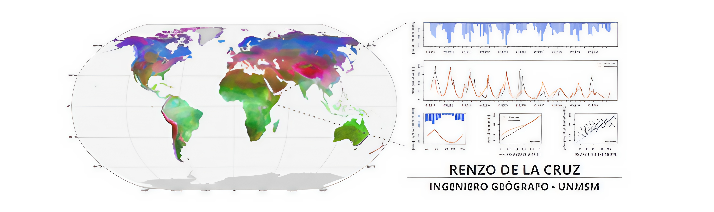

## Hola 👋 ¡Soy Renzo!
Soy bachiller en Ingeniería Geográfica por la Universidas Nacional Mayor de San Marcos (UNMSM), con una sólida formación y pasión por las tecnologías en información geográfica, la estadística y las ciencias ambientales. Tengo experiencia en sensoramiento remoto (teledetección), sistemas de información geográfica (GIS), ciencia de datos espaciales y en la evaluación de riesgos originados por fenómenos naturales.

### 🚀 Sobre mí:
- 🧪 Me interesa la investigación científica orientada al análisis territorial y ambiental.
- 🛰️ Trabajo actualmente en el Instituto Nacional de Investigación en Glaciares y Ecosistemas de Montaña (INAIGEM).
- 📊 Estoy profundizando mis conocimientos en estadística, machine learning y ciencia de datos.
- 🛠️ Tengo experiencia con software de procesamiento de imágenes satelitales como **ENVI**, **PCI Geomatics**, **SNAP Sentinel** y **Google Earth Engine**.
- 🌍 Manejo herramientas de análisis espacial como **QGIS** y **ArcGIS**.
- 💻 Utilizo **R** y **Python** para análisis estadístico, automatización de procesos y visualización de datos geoespaciales.

### 📫 ¿Hablamos?
Puedes contactarme a través de:
- 📧 Correo: renzoangeldelacruz@gmail.com
- 💼 LinkedIn: https://www.linkedin.com/in/renzo-delacruz/
